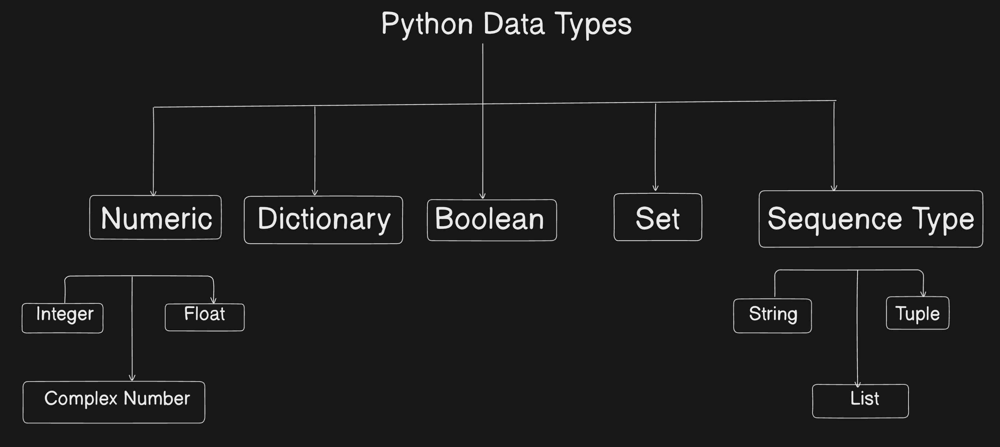

# PYTHON

## Syntax and Semantics in Python:
1. Syntax:
- Syntax refers to the set of rules that defines the combinations of symbols that are considerable to be correctly structured programs in a language.
- In simple terms, syntax is about the correct arrangement of words and symbols in a code.
- Python is case sensitive.

#### Basic Syntax rules in Python

```
name = "Saad"
Name = "Khan"

print(name)  # Output: Saad
print(Name)  # Output: Khan
```

2. Semantics:
- Semantics refers to the meanings or interpreatation of the symbols, characters, and commands in a language.
- It is about what the code is supposed to do when it runs.

3. Indentation:
- Indentation in Python is used to define the structure and hierarchy of the code.
- Unlike many other programming languages that uses braces {} to delimit the blocks of code, Python uses indentation to determine the grouping of statements.
- This means that all statements within a block must be indented at the same level.
- Python uses indentation to define block of code. Consistent use of spaces (commonly 4) or a tab is required

```
age = 32
if age > 30:
    print("You are old")
else:
    print("You are not old")

print(age)
```
## Variables:
- Variables are fundamental elements in programming used to store data that can be referenced and manipulated in a program.
- In python, variables are created when you assign a value to them, and they do not need explicit declaration to reserve memory space.
- The declaration to reserve memoruy space. The declaration happens automatically when you assign a value to variable.
- Valid variable names examples:
```
## valid variable names:
first_name = "Saad"
last_name = "Khan"
full_name = first_name + " " + last_name
print(full_name)
```
- Invalid variable names examples:
```
1. 2names = "Saad"
2. 2 names = "Saad"
3. @names = "Saad"
```

### Understanding variable types:
- Python is dynamically typed, type of a variable is determined at runtime
```
age = 29 #int
height = 5.2 #float
name = "Saad" #string
is_student = True #boolean
print(type(age), type(height), type(name), type(is_student))

# Output:
<class 'int'> <class 'float'> <class 'str'> <class 'bool'>
```

## Datatypes:
1. Definition:
- Datatypes are a classification of data which tell the compiler or interpreter how the program intends to use the data.
- They determine the type of operations that can be performed on the data, the values that can be stored, and the amount of memory needed to store the data.

2. Importance of Data Types in Programming:
- Datatypes ensure that the data is stored in an efficiet way.
- They help in performing correct operations on data.
- Proper use of datatypes can prevent errors and bugs in the program.

3. Python DataTypes:



## Important Notice:
- It is always advisable and good practice that we should create a separate environment(venv) for any project we work on , so that we can segregate the packages and libraries in a very easy way and if in future there are any new updates in those packages.