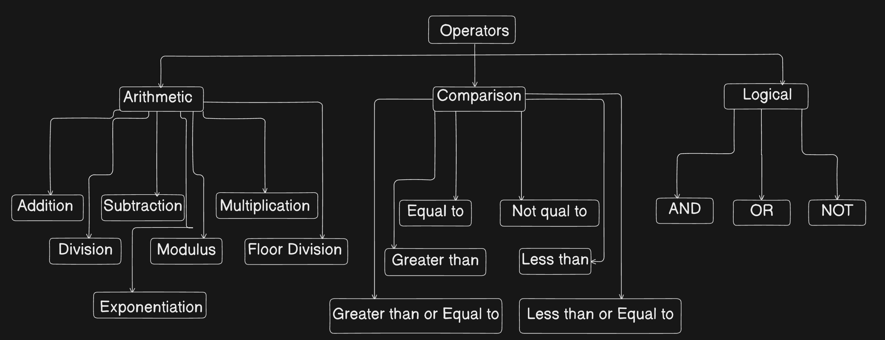

# PYTHON

## Syntax and Semantics in Python:
1. Syntax:
- Syntax refers to the set of rules that defines the combinations of symbols that are considerable to be correctly structured programs in a language.
- In simple terms, syntax is about the correct arrangement of words and symbols in a code.
- Python is case sensitive.

#### Basic Syntax rules in Python

```
name = "Saad"
Name = "Khan"

print(name)  # Output: Saad
print(Name)  # Output: Khan
```

2. Semantics:
- Semantics refers to the meanings or interpreatation of the symbols, characters, and commands in a language.
- It is about what the code is supposed to do when it runs.

3. Indentation:
- Indentation in Python is used to define the structure and hierarchy of the code.
- Unlike many other programming languages that uses braces {} to delimit the blocks of code, Python uses indentation to determine the grouping of statements.
- This means that all statements within a block must be indented at the same level.
- Python uses indentation to define block of code. Consistent use of spaces (commonly 4) or a tab is required

```
age = 32
if age > 30:
    print("You are old")
else:
    print("You are not old")

print(age)
```
## Variables:
- Variables are fundamental elements in programming used to store data that can be referenced and manipulated in a program.
- In python, variables are created when you assign a value to them, and they do not need explicit declaration to reserve memory space.
- The declaration to reserve memoruy space. The declaration happens automatically when you assign a value to variable.
- Valid variable names examples:
```
## valid variable names:
first_name = "Saad"
last_name = "Khan"
full_name = first_name + " " + last_name
print(full_name)
```
- Invalid variable names examples:
```
1. 2names = "Saad"
2. 2 names = "Saad"
3. @names = "Saad"
```

### Understanding variable types:
- Python is dynamically typed, type of a variable is determined at runtime
```
age = 29 #int
height = 5.2 #float
name = "Saad" #string
is_student = True #boolean
print(type(age), type(height), type(name), type(is_student))

# Output:
<class 'int'> <class 'float'> <class 'str'> <class 'bool'>
```

## Datatypes:
1. Definition:
- Datatypes are a classification of data which tell the compiler or interpreter how the program intends to use the data.
- They determine the type of operations that can be performed on the data, the values that can be stored, and the amount of memory needed to store the data.

2. Importance of Data Types in Programming:
- Datatypes ensure that the data is stored in an efficiet way.
- They help in performing correct operations on data.
- Proper use of datatypes can prevent errors and bugs in the program.

3. Python DataTypes:


# Operators in Python:

- Example:
1. Arithmetic Operators:
```
a = 10
b = 5

add_result = a + b
print(add_result)
# Output
15

sub_result = a - b
print(sub_result)
# Output
5

mul_result = a * b
print(mul_result)
# Output
50

div_result = a / b
print(div_result)
# Output
2.0

mod_result = a % b
print(mod_result)
# Output
0

exp_result = a ** b
print(exp_result)
# Output
100000
```
2. Comparison Operators:

```
a = 10
b = 5
print(a == b)
# Output
False

print(a != b)
# Output
True

print(a > b)
# Output
True

print(a < b)
# Output
False

print(a >= b)
# Output
True

print(a <= b)
# Output
False
```
3. Logical Operators:
```
a = True
b = False

print(a and b)
# Output
False

print(a or b)
# Output
True

print(not a)
# Output
False
```

## Conditional Statements:
1. if-statement:
- The if condition is considered the simplest of the three and makes a decision based on whether the condition is true or not. 
- If the condition is true, it prints out the indented expression. If the condition is false, it skips printing the indented expression.
```
age = 23
if age>= 18:
    print("You are old enough to vote!")
```
2. else-statement:
- The else statement executes a block of code if the condition in the if statement is False.
```
age = 16

if age>=18:
    print("You are old enough to vote!")
else:
    print("You are not old enough to vote!")
```
3. elif-statement:
- The elif statement allows you to check multiple conditions. It stands for "else if"
```
age = 17

if age < 13:
    print("Ypou are a child")
elif age < 18:
    print("You are a teenager")
else:
    print("You are an adult")
```

## Loops:
- Loops are used to execute a block of code repeatedly until a certain condition is met.
- There are two types of loops in Python:
1. for-loop:
- The for loop is used to iterate over a sequence (such as a list, tuple, or string) or other iterable objects.
```
for i in range(5):
    print(i)
```
2. while-loop:
- The While Loop is used to execute a block of statements repeatedly until a given condition is satisfied. 
- The condition is checked before each iteration of the loop. When the condition becomes false, the line immediately after the loop in the program is executed.
```
count = 0
while count < 3:
    count = count + 1
    print("Hello Geek")
```

## Data Structures:
- Data structures are used to organize and manage data in a program.
- Python has four built-in data structures:
#### 1. Lists:
- Lists are ordered, mutable collections of items.
- They can contain elements of different data types, including numbers, strings, and even other lists
- Lists are defined using square brackets [] and elements are separated by commas.
- Lists are mutable, meaning you can change, add, or remove elements after the list is created.
- Example:
```
marks = [54, 23, 64, 93, 32]
mixed = [45, "Saad", 23.5, True]
print(marks) # Output: [54, 23, 64, 93, 32]
print(mixed) # Output: [45, 'Saad', 23.5, True]
print(type(marks)) # Output: <class 'list'>
print(type(mixed)) # Output: <class 'list'>
```
#### List Methods:
- Python provides several built-in methods to manipulate lists:
1. append(item): Adds an item to the end of the list.
2. insert(index, item): Inserts an item at a specified index.
3. remove(item): Removes the first occurrence of an item from the list.
4. pop(index): Removes and returns the item at the specified index (default is the last item).
5. sort(): Sorts the list in ascending order.
6. reverse(): Reverses the order of the list.
7. index(item): Returns the index of the first occurrence of an item.
8. count(item): Returns the number of occurrences of an item in the list.
- Example:
```
marks = [5, 2, 21, 5, 7]
extra_marks = [45, 67, 89]
print(marks)

marks.append(63)  # adds 63 to the end of the list
marks.pop()     # removes the last element from the list
marks.sort()    # sorts the list in ascending order
marks.reverse() # reverses the list
marks.insert(2, 23) # inserts 23 at index 2
marks.remove(23) # removes the first occurrence of 23
marks.count(5) # counts the number of occurrences of 5
marks.index(5) # returns the index of the first occurrence of 5
marks.extend(extra_marks) # extends the list by adding elements from another list
marks.clear() # clears the list
marks.copy() # returns a shallow copy of the list

print(marks)
```

#### List Comprehension:
- List comprehension is a concise way to create lists in Python.
- It allows you to generate a new list by applying an expression to each item in an existing iterable (like a list or range) and optionally filtering items based on a condition.
- The syntax for list comprehension is:
```
table_comp = [5 * i for i in range(1, 11)]
print(table_comp)
```


## Important Notice:
- It is always advisable and good practice that we should create a separate environment(venv) for any project we work on , so that we can segregate the packages and libraries in a very easy way and if in future there are any new updates in those packages.