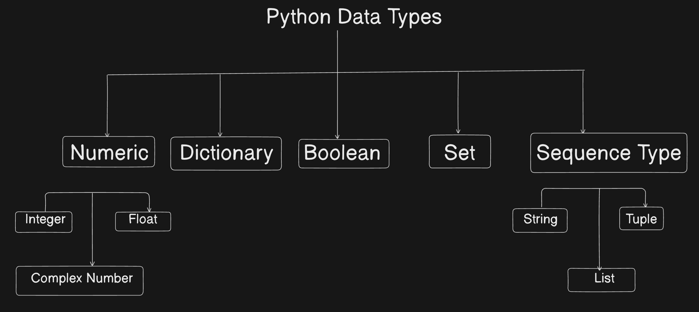
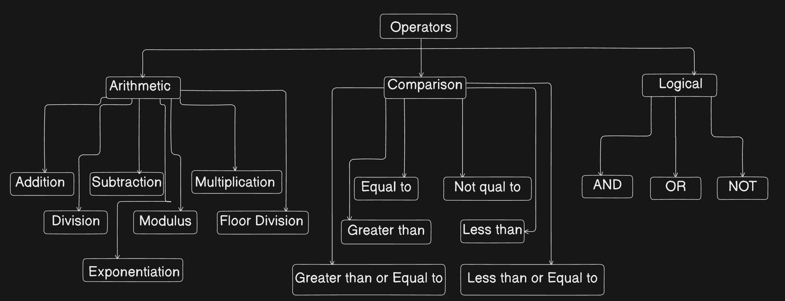

# PYTHON

## Syntax and Semantics in Python:
1. Syntax:
- Syntax refers to the set of rules that defines the combinations of symbols that are considerable to be correctly structured programs in a language.
- In simple terms, syntax is about the correct arrangement of words and symbols in a code.
- Python is case sensitive.


#### Different ways to create a virtual environment in Python:
1. Using venv module:
- venv module is a built-in module in Python 3.3 and later versions.
- It creates a self-contained directory that contains a Python installation for a particular version of Python.
- Example:
```
python -m venv myenv
```
2. Using virtualenv module:
- virtualenv is a third-party module that can be installed using pip.
- It creates a self-contained directory that contains a Python installation for a particular version of Python.
- Example:
```
pip install virtualenv
virtualenv myenv
```

3. Using Anaconda:
- Anaconda is a popular distribution of Python that comes with a package manager called conda.
- It provides a convenient way to create and manage virtual environments.
- Example:
```
conda create -n myenv python=3.7
```

#### Basic Syntax rules in Python

```
name = "Saad"
Name = "Khan"

print(name)  # Output: Saad
print(Name)  # Output: Khan
```

2. Semantics:
- Semantics refers to the meanings or interpreatation of the symbols, characters, and commands in a language.
- It is about what the code is supposed to do when it runs.

3. Indentation:
- Indentation in Python is used to define the structure and hierarchy of the code.
- Unlike many other programming languages that uses braces {} to delimit the blocks of code, Python uses indentation to determine the grouping of statements.
- This means that all statements within a block must be indented at the same level.
- Python uses indentation to define block of code. Consistent use of spaces (commonly 4) or a tab is required

```
age = 32
if age > 30:
    print("You are old")
else:
    print("You are not old")

print(age)
```
## Variables:
- Variables are fundamental elements in programming used to store data that can be referenced and manipulated in a program.
- In python, variables are created when you assign a value to them, and they do not need explicit declaration to reserve memory space.
- The declaration to reserve memoruy space. The declaration happens automatically when you assign a value to variable.
- Valid variable names examples:
```
## valid variable names:
first_name = "Saad"
last_name = "Khan"
full_name = first_name + " " + last_name
print(full_name)
```
- Invalid variable names examples:
```
1. 2names = "Saad"
2. 2 names = "Saad"
3. @names = "Saad"
```

### Understanding variable types:
- Python is dynamically typed, type of a variable is determined at runtime
```
age = 29 #int
height = 5.2 #float
name = "Saad" #string
is_student = True #boolean
print(type(age), type(height), type(name), type(is_student))

# Output:
<class 'int'> <class 'float'> <class 'str'> <class 'bool'>
```

## Datatypes:
1. Definition:
- Datatypes are a classification of data which tell the compiler or interpreter how the program intends to use the data.
- They determine the type of operations that can be performed on the data, the values that can be stored, and the amount of memory needed to store the data.

2. Importance of Data Types in Programming:
- Datatypes ensure that the data is stored in an efficiet way.
- They help in performing correct operations on data.
- Proper use of datatypes can prevent errors and bugs in the program.

3. Python DataTypes:


# Operators in Python:

- Example:
1. Arithmetic Operators:
```
a = 10
b = 5

add_result = a + b
print(add_result)
# Output
15

sub_result = a - b
print(sub_result)
# Output
5

mul_result = a * b
print(mul_result)
# Output
50

div_result = a / b
print(div_result)
# Output
2.0

mod_result = a % b
print(mod_result)
# Output
0

exp_result = a ** b
print(exp_result)
# Output
100000
```
2. Comparison Operators:

```
a = 10
b = 5
print(a == b)
# Output
False

print(a != b)
# Output
True

print(a > b)
# Output
True

print(a < b)
# Output
False

print(a >= b)
# Output
True

print(a <= b)
# Output
False
```
3. Logical Operators:
```
a = True
b = False

print(a and b)
# Output
False

print(a or b)
# Output
True

print(not a)
# Output
False
```

## Conditional Statements:
1. if-statement:
- The if condition is considered the simplest of the three and makes a decision based on whether the condition is true or not. 
- If the condition is true, it prints out the indented expression. If the condition is false, it skips printing the indented expression.
```
age = 23
if age>= 18:
    print("You are old enough to vote!")
```
2. else-statement:
- The else statement executes a block of code if the condition in the if statement is False.
```
age = 16

if age>=18:
    print("You are old enough to vote!")
else:
    print("You are not old enough to vote!")
```
3. elif-statement:
- The elif statement allows you to check multiple conditions. It stands for "else if"
```
age = 17

if age < 13:
    print("Ypou are a child")
elif age < 18:
    print("You are a teenager")
else:
    print("You are an adult")
```

## Loops:
- Loops are used to execute a block of code repeatedly until a certain condition is met.
- There are two types of loops in Python:
1. for-loop:
- The for loop is used to iterate over a sequence (such as a list, tuple, or string) or other iterable objects.
```
for i in range(5):
    print(i)
```
2. while-loop:
- The While Loop is used to execute a block of statements repeatedly until a given condition is satisfied. 
- The condition is checked before each iteration of the loop. When the condition becomes false, the line immediately after the loop in the program is executed.
```
count = 0
while count < 3:
    count = count + 1
    print("Hello Geek")
```

## Data Structures:
- Data structures are used to organize and manage data in a program.
- Python has four built-in data structures:
#### 1. Lists:
- Lists are ordered, mutable collections of items.
- They can contain elements of different data types, including numbers, strings, and even other lists
- Lists are defined using square brackets [] and elements are separated by commas.
- Lists are mutable, meaning you can change, add, or remove elements after the list is created.
- Example:
```
marks = [54, 23, 64, 93, 32]
mixed = [45, "Saad", 23.5, True]
print(marks) # Output: [54, 23, 64, 93, 32]
print(mixed) # Output: [45, 'Saad', 23.5, True]
print(type(marks)) # Output: <class 'list'>
print(type(mixed)) # Output: <class 'list'>
```
#### List Methods:
- Python provides several built-in methods to manipulate lists:
1. append(item): Adds an item to the end of the list.
2. insert(index, item): Inserts an item at a specified index.
3. remove(item): Removes the first occurrence of an item from the list.
4. pop(index): Removes and returns the item at the specified index (default is the last item).
5. sort(): Sorts the list in ascending order.
6. reverse(): Reverses the order of the list.
7. index(item): Returns the index of the first occurrence of an item.
8. count(item): Returns the number of occurrences of an item in the list.
- Example:
```
marks = [5, 2, 21, 5, 7]
extra_marks = [45, 67, 89]
print(marks)

marks.append(63)  # adds 63 to the end of the list
marks.pop()     # removes the last element from the list
marks.sort()    # sorts the list in ascending order
marks.reverse() # reverses the list
marks.insert(2, 23) # inserts 23 at index 2
marks.remove(23) # removes the first occurrence of 23
marks.count(5) # counts the number of occurrences of 5
marks.index(5) # returns the index of the first occurrence of 5
marks.extend(extra_marks) # extends the list by adding elements from another list
marks.clear() # clears the list
marks.copy() # returns a shallow copy of the list

print(marks)
```

#### List Comprehension:
- List comprehension is a concise way to create lists in Python.
- It allows you to generate a new list by applying an expression to each item in an existing iterable (like a list or range) and optionally filtering items based on a condition.
- The syntax for list comprehension is:
```
table_comp = [5 * i for i in range(1, 11)]
print(table_comp)
```

#### 2. Tuples:
- Tuples are ordered, immutable collections of items.
- They are similar to lists but cannot be modified after creation.
- Tuples are defined using parentheses () and elements are separated by commas.
- Example:
```
a = (3, 2, 22, 13)
print(a)
print(type(a))
print(a[2])  # Output: 22

Single Element Tuple:
b = (5,)  
print(b)
```

#### Tuple Unpacking:
- Tuple unpacking allows you to assign the elements of a tuple to individual variables in a single statement.
- Example:
```
tu = (3, 2, 45)
a, b, c = tu
print(a, b, c)  # Output: 3 2 45
```

#### Tuple Methods:
- Tuples have a limited number of built-in methods due to their immutability:
1. count(item): Returns the number of occurrences of an item in the tuple.
2. index(item): Returns the index of the first occurrence of an item.
- Example:
```
t = (3, 12, 1, 54, 23, 12)
print(t.count(12))  # Output: 2
print(t.index(54))  # Output: 3
```

#### Why Use Tuples?
- Tuples are used when you want to create a collection of items that should not be modified.
- They are more memory efficient than lists and can be used as keys in dictionaries.

#### 3. Sets:
- Sets are built-in data type in Python that are used to store collections of unique elements.
- They are unordered meaning that the elements do not follow a specific order, and they do not allow duplicate elements.
- Sets are useful for membership testing, removing duplicates, and performing mathematical operations like union, intersection,difference and symmetric difference.
- Sets are defined using curly braces {} and elements are separated by commas.
- Example:
```
my_set = {1, 2, 3, 4, 5}
print(my_set)  # Output: {1, 2, 3, 4, 5}
print(type(my_set))  # Output: <class 'set'>
```

## Sets Methods:
- Python provides several built-in methods to manipulate sets:
1. add(item): Adds an item to the set.
2. remove(item): Removes an item from the set. Raises a KeyError if the item is not found.
3. discard(item): Removes an item from the set if it exists. Does not raise an error if the item is not found.
4. pop(): Removes and returns an arbitrary item from the set.
5. clear(): Removes all items from the set.
- Example:
```
s = {34, 23, 1, 3}
s.add(45)  # adds 45 to the set
s.remove(3) # removes 3 from the set
s.discard(10) # tries to remove 10 from the set, but does not
s.pop() # removes and returns an arbitrary item from the set
s.clear() # clears the set
print(s)
```

## Set Operations:
- Sets support various mathematical operations:
1. Union (|): Combines two sets, including all unique elements from both sets.
2. Intersection (&): Returns only the elements that are present in both sets.
3. Difference (-): Returns elements that are in the first set but not in the second set
4. Symmetric Difference (^): Returns elements that are in either set but not in both.
5. issubset(): Checks if one set is a subset of another.
6. issuperset(): Checks if one set is a superset of another.
7. isdisjoint(): Checks if two sets have no elements in common.
8. copy(): Returns a shallow copy of the set.
- Example:
```
a = {3, 23, 1}
b = {23, 4, 2, 55, 1}

c = a.union(b) # Union of two sets
print("Union:", c)
d = a.intersection(b) # Intersection of two sets
print("Intersection:", d)
e = a.difference(b) # Elements in a but not in b
print("Difference (a-b):", e)
f = b.difference(a) # Elements in b but not in a
print("Difference (b-a):", f)
g = a.symmetric_difference(b) # Elements in either a or b but not in both
print("Symmetric Difference:", g)
h = a.issubset(b) # Check if a is subset of b
print("Is a subset of b:", h)
i = a.issuperset(b) # Check if a is superset of b
print("Is a superset of b:", i)
j = a.isdisjoint(b) # Check if a and b have no elements in common
print("Are a and b disjoint:", j)
k = a.copy() # Shallow copy of set a
print("Copy of a:", k)
l = a.clear() # Clear all elements from set a
print("Cleared a:", a)
```

### Important Point 🧠:
- when we call add(), Python:
	1.	Calculates the hash of the element.
	2.	Puts it in a bucket in the hash table.
	3.	Prints the set in whatever order it currently has internally — not “first added, first shown.”

#### 4. Dictionaries:
- Dictionaries are unordered collections of key-value pairs.
- They are defined using curly braces {} with key-value pairs separated by commas.
- Keys must be unique and immutable, while values can be of any data type.
- Example:
```
my_dict = {"name": "Saad", "age": 29, "city": "Mumbai"}
print(my_dict)  # Output: {'name': 'Saad', 'age': 29, 'city': 'Mumbai'}
print(my_dict["name"])  # Output: Saad
print(type(my_dict))  # Output: <class 'dict'>
```

#### Dictionary Methods:
- Python provides several built-in methods to manipulate dictionaries:
1. keys(): Returns a view object containing the keys of the dictionary.
2. values(): Returns a view object containing the values of the dictionary.
3. items(): Returns a view object containing the key-value pairs of the dictionary.
4. get(key, default): Returns the value for the specified key. If the key is not found, returns the default value (None if not specified).
5. update(other_dict): Updates the dictionary with key-value pairs from another dictionary.
6. pop(key, default): Removes the specified key and returns its value. If the key is not found, returns the default value (raises KeyError if not specified).
7. popitem(): Removes and returns an arbitrary key-value pair from the dictionary.
8. clear(): Removes all items from the dictionary.
- Example:
```
marks = {"Saad": 54, "Abuzar": 45, "Umaima": 93}

print(marks.keys())  # Prints all the keys in the dictionary
print(marks.values())  # Prints all the values in the dictionary
print(marks.items())  # Prints all the key-value pairs in the dictionary
marks.update({"Saad": 100, "Ali": 67})  # Updates the dictionary with new key-value pairs
print(marks)
marks.pop("Ali")  # Removes the key-value pair with the specified key
print(marks)
marks.popitem()  # Removes the last key-value pair from the dictionary
print(marks)
marks.clear()  # Clears the dictionary
print(marks)
```

#### Dictionary Comprehension:
- Dictionary comprehension is a concise way to create dictionaries in Python.
- It allows you to generate a new dictionary by applying an expression to each item in an existing
- iterable (like a list or range) and optionally filtering items based on a condition.
- The syntax for dictionary comprehension is:
```
table_comp = {i: 5*i for i in range(1, 11)}
print(table_comp)
```
#### When to Use Each Data Structure:
| Data Structure    | Features                | Best For                                |
|-------------------|-------------------------|-----------------------------------------|
| List              | 28                      | Storing Sequences, Dynamic Data         |
| Tuple             | 25                      | Fixed collections, dictionary keys.     |
| Set               | Unordered, Unique       | Removing duplicates, set operations     |
| Dictionary        | Key-Value Pairs         | Fast lookups, structured data           |

## Functions:
- A function is a block of code that performs a specific task. 
- It can be called from other parts of the code to perform the same task. 
- In Python, Functions can be defined using the `def` keyword.

#### Defining Functions in Python:
- Example:
```
def greet(name):
    return f"Hello, {name}!"
print(greet("Saad"))  # Output: Hello, Saad!
``` 
#### Key Points:
- Define using def keyword.
- Function name should be descriptive.
- Use `return` to send a value back

#### Functions Arguments and Return Values:
- Functions can accept inputs called arguments or parameters.
- There are different types of function arguments:
1. Positional Arguments: Arguments are passed in the same order as the parameters are defined.
    - Example:
    ```
    def add(a, b):
         return a + b
    print(add(2, 3))  # Output: 5
    ```
2. Keyword Arguments: Arguments are passed by explicitly specifying the parameter name.
    - Example:
    ```
    def add(a, b):
         return a + b
    print(add(b=3, a=2))  # Output: 5
    ```
3. Default Arguments: Parameters can have default values, which are used if no argument is provided
    - Example:
    ```
    def greet(name="Guest"):
         return f"Hello, {name}!"
    print(greet())  # Output: Hello, Guest!
    print(greet("Saad"))  # Output: Hello, Saad!
    ```

#### Lambda Functions:
- Lambda functions are small anonymous functions defined using the lambda keyword.
- They can take any number of arguments but can only have a single expression.
- Example:
```
square = lambda x: x * x
print(square(5))
```

#### Recursion:
- Recursion is a programming technique where a function calls itself to solve a problem.
- A recursive function typically has a base case to stop the recursion and a recursive case to continue.
- Example:
```
def factorial(n):
    if n == 0 or n == 1:  # Base case
        return 1
    else:
        return n * factorial(n - 1)  # Recursive case
print(factorial(5))  # Output: 120
```

## Modules and Pip (using external libraries):

There are two type of modules in Python:
1. Built-in Modules: These are pre-installed with Python and can be used directly without any
   additional installation. Examples include `math`, `sys`, `os`, etc.
2. External Modules: These are third-party modules that need to be installed separately using package
   managers like pip. Examples include `numpy`, `pandas`, `requests`, etc.
#### Key Points:
- Modules are files containing Python code that can define functions, classes, and variables.
- They allow you to organize your code into separate files and reuse code across different programs.
- You can create your own modules or use built-in modules and third-party libraries.
- To use a module, you can import it using the import statement.
- Example:
```
import math
print(math.sqrt(16))  # Output: 4.0
```
- Pip is the package installer for Python. It allows you to install and manage third-party libraries and packages.
- To install a package using pip, you can use the command:
```
pip install requests

import requests

response = requests.get("https://api.github.com")
print(response.status_code)  # Output: 200
```

#### Exception Handling and Custom Errors:
- Exception handling is a fundamental concept in Python that allows you to handle errors or unexpected events that occur during program execution.
- It helps in maintaining the normal flow of the program even when errors occur.
- In Python, exceptions are handled using the try-except block.
- Example:
```
while True:
    try:
        a = int(input("Enter number 1:"))
        b = int(input("Enter number 2:"))

        print("The sum is:", a + b)
    except:
        print("Invalid input, please try again.")
```
- Custom errors can be created using the `raise` statement.
- Example:
```
def divide(a, b):
    if b == 0:
        raise ValueError("Cannot divide by zero")
    return a / b
try:
    print(divide(10, 0))
except ValueError as e:
    print(e)
```
#### else-finally:
- The else block is executed if no exceptions are raised in the try block.
- The finally block is executed regardless of whether an exception was raised or not.
- Example:
```
try:
    a = int(input("Enter number 1:"))
    b = int(input("Enter number 2:"))

    print("The sum is:", a + b)
except ValueError:
    print("Invalid input, please enter integers only.")
else:
    print("No exceptions occurred, the operation was successful.")
finally:
    print("This block is always executed, cleaning up resources if needed.")
``` 


#### Object Oriented Programming(OOPS) in Python:

#### 1. What is Object Oriented Programming(OOPS)?
- Object-Oriented Programming (OOP) is a programming paradigm that organizes code into objects, which combine data (attributes) and functions (methods) that operate on that data.

- 👉 In simple terms: OOP lets you model real-world things (like a Car, Student, or Bank Account) as objects in code. 
- OOP helps make code more modular, reusable, and easier to maintain.

#### 🧱 4 Pillars of OOP
1.	Encapsulation 🧰 :
- Encapsulation llows us to bundle data (attributes) and behaviors (methods) within a class to create a cohesive unit. 
- By defining methods to control access to attributes and its modification, encapsulation helps maintain data integrity and promotes modular, secure code.
2.	Abstraction 🎭 :
- Abstraction focuses on hiding implementation details and exposing only the essential functionality of an object. 
- By enforcing a consistent interface, abstraction simplifies interactions with objects, allowing developers to focus on what an object does rather than how it achieves its functionality.
3.  Inheritance 🧬 :
- Inheritance enables the creation of hierarchical relationships between classes, allowing a subclass to inherit attributes and methods from a parent class.
- This promotes code reuse and reduces duplication
4.  Polymorphism 🔄 :
- Polymorphism allows you to treat objects of different types as instances of the same base type, as long as they implement a common interface or behavior. 
- Python’s duck typing make it especially suited for polymorphism, as it allows you to access attributes and methods on objects without needing to worry about their actual class.

#### Class and Objects:
##### Class:
- A class is a blueprint for creating objects. It defines the attributes and methods that the objects of that class will have. 
- Eg: Form for an Exam that contains name, age, elective, father's name etc.


##### Object:
- An object is an instance of a class. It represents a specific entity with its own state and behavior.
- Eg: Form which contains the data for John Doe

##### Creating a Class and Object in Python:
```
class Employee:
    company = "HP"
    
    def get_salary(self):
        return 34000
```
- Self: It is a way to reference the object of the class which is being created.

#### Constructors:
- A constructor is a special method that is automatically called when an object of a class is created.
- It is used to initialize the attributes of the object.
- In Python, the constructor method is defined using the __init__() method.
- Example:
```
class Employee:    
    def __init__(self, salary, name, bond):
        self.salary = salary # create an instance variable of name salary and assign it with salary
        self.name = name
        self.bond = bond  

    def get_salary(self): 
        return self.salary   

    def get_info(self):
        return f"The name of the employee is {self.name} and salary is {self.salary}. The bond is {self.bond} years."  
          
e1 = Employee(34000, "Saad", 4)
print(e1.get_salary())
print(e1.get_info())

```

#### Object Introspection:
- Object introspection is a mechanism in Python that allows you to get information about an object at runtime.
- It provides a way to examine the attributes, methods, and properties of an object dynamically.

#### Inheritance:
- Inheritance is a fundamental concept in object-oriented programming that allows a class (called the child or subclass) to inherit attributes and methods from another class (called the parent or superclass).
- This promotes code reuse and establishes a hierarchical relationship between classes.
- Example:
```
class Animal:
    def __init__(self, name):
        self.name = name
    
    def speak(self):
        print("Generic animal sound")
        
class Dog(Animal): # Dog class inherits from Animal class
    def speak(self): # overriding the speak method
        print(f"{self.name} says Woof Woof!")

class Cat(Animal): # Cat class inherits from Animal class
    def speak(self): # overriding the speak method
        print(f"{self.name} says Meow Meow!")
        
my_dog = Dog("Buddy")
my_cat = Cat("Whiskers")

print(my_dog.name) # accessing instance variable from parent class
my_dog.speak() # calling overridden method

print(my_cat.name) # accessing instance variable from parent class
my_cat.speak() # calling overridden method
```

#### Polymorphism:
- Polymorphism is a concept in object-oriented programming that allows objects of different classes to be treated as instances of the same base class.
- It enables a single interface to represent different underlying forms (data types).
- Example:
```
# Calling Parent Constructor with super()
class Bird(Animal):
    def __init__(self, name, wingspan):
        super().__init__(name)  # Call Animal's __init__ to set the name
        self.wingspan = wingspan # Add a Bird-specific attribute

my_bird = Bird("Tweety", 10)
print(my_bird.name)      # Output: Tweety (set by Animal's constructor)
print(my_bird.wingspan)  # Output: 10   (set by Bird's constructor)
```

#### Operator Overloading:
- Operator overloading is a feature in Python that allows you to define custom behavior for standard operators (like +, -, *, etc.) when they are used with instances of your classes.
- By overloading operators, you can make your custom objects behave like built-in types, making
    them more intuitive to use.
- Example:
```
class Point:
    def __init__(self, x, y):
        self.x = x
        self.y = y
        
    def sum(self, p):
        return Point(self.x + p.x, self.y + p.y)
    
    def print_point(self):
        print(f"X is {self.x} and Y is {self.y}")
        
    def __add__(self, p):
        return Point(self.x + p.x, self.y + p.y)

p1 = Point(3, 2)
p2 = Point(6, 3)

# p = p1.sum(p2)
p = p1 + p2  # using __add__ method
p.print_point()
```

### Advanced Concepts:

#### 1. Decorators:
- Decorators are a powerful feature in Python that allows you to modify the behavior of a function or class method without changing its actual code.
- They are often used for logging, access control, caching, and other cross-cutting concerns
- A decorator is a function that takes another function as an argument, extends its behavior, and returns a new function.

- Example:
```
# Decorator is a function that takes a function, it creates a new function inside its body (wrapper) and returns a new function.
def decorator(func):
    def wrapper():
        print("I am about to call a function")
        func()
        print("I have called the function")
    return wrapper

@decorator
def say_hello():
    print("Hello")
    
say_hello()
# f = decorator(say_hello)
# f()
'''
f will look something like this:
def f():
    print("I am about to call a function")
    print("Hello")
    print("I have called the function")
'''
```

##### Decorators with Arguments::
- If the function being decorated takes arguments, the wrapper function inside the decorator must also accept those arguments and pass them to the original function.
- Example:
```
def repeat(n):
    def decorator(func):
        def wrapper(a):
            for i in range(n):
                func(a)
        return wrapper
    return decorator

@repeat(7)
def say_hello(name):
    print(f"Hello {name}")
    
say_hello("Saad")
```


#### 2. Getters and Setters:
- Getters and setters are methods used to access and modify the attributes of a class.
- They provide a way to encapsulate the internal representation of an object and control how its attributes are accessed and modified.
- Example:
```
class Employee:
    def __init__(self, name, salary):
        self.name = name
        self.salary = salary
    
    @property
    def first_name(self):
        l = self.name.split(" ")
        return l[0]
    
    @first_name.setter
    def first_name(self, first):
        l = self.name.split(" ")
        new_name = f"{first} {l[1]}"
        self.name = new_name

e = Employee("Saad Khan", 50000)
# print(e.first_name())
# e.set_first_name("Abuzar")
# print(e.name)

print(e.first_name)
e.first_name = "Abuzar"
print(e.name)
```

##### Important Point 🧠:
- To make an attribute read-only, define just the @property decorator (the getter) and leave out the @name.setter method.
- Trying to set the attribute will raise an AttributeError.

#### 3. Static and Class Methods:
- Static and class methods are special methods that can be defined inside a class.
- Static methods are bound to the class rather than the instance of the class, while class methods are bound to the class itself.
- Example:
```
class Employee:
    company = "Google"
    
    def __init__(self, name, salary):
        self.name = name
        self.salary = salary
    
    # Instance Method
    def print_info(self):
        print(f"Employee Name: {self.name}, Salary: {self.salary}")
        
    # Static Method
    @staticmethod
    def sum(a, b):
        return a + b
    
    # Class Method
    @classmethod
    def print_company(cls):
        print(cls.company) 
    @classmethod
    def change_company(cls, new_company):
        cls.company = new_company

e1 = Employee("Saad", 100000)
e2 = Employee("Abuzar", 120000)
# print(Employee.company)
# print(Employee.name)

e1.print_info()
e2.print_info()

# print(e2.sum(5, 7))
print(Employee.company)
e1.change_company("Amazon")
print(Employee.company)
```

##### Important Point 🧠:
- Static methods can be called on the class itself, not on an instance of the class.
- Class methods can be called on the class itself, but they also have access to the class itself.

#### 4. Magic Methods or Dunder Methods:
- Magic methods or dunder methods are special methods in Python that allow you to customize the behavior of built-in operators or built-in functions.
- They are called "dunder" methods because they are surrounded by double underscores (e.g., __init__, __add__, __str__).
- Example:
```
class Employee:
    company = "Google"
    
    def __init__(self, name, salary):
        self.name = name
        self.salary = salary
    
    def __str__(self):
        return f"The name of the employee is {self.name} and the salary is {self.salary}"
    
    def __repr__(self):
        return f"Employee: {self.name}\nsalary: {self.salary}"
    
    def __len__(self):
        return len(self.name)
        
e = Employee("Saad", 100000)
print(len(e))
print(e.name, e.salary)
print(str(e))
print(repr(e))
```

##### Common Magic Methods:
| Magic Method   | Description                                      | Example Usage                       |
|----------------|--------------------------------------------------|------------------------------------|
| `__init__`     | Constructor method to initialize an object      | `obj = MyClass()`                  |
| `__str__`      | String representation of an object              | `print(obj)`                       |
| `__repr__`     | Official string representation of an object     | `repr(obj)`                        |
| `__add__`      | Addition operator overloading                   | `obj1 + obj2`                      |
| `__sub__`      | Subtraction operator overloading                | `obj1 - obj2`                      |
| `__mul__`      | Multiplication operator overloading             | `obj1 * obj2`                      |
| `__len__`      | Length of an object                             | `len(obj)`                         |
| `__getitem__`  | Accessing an item using indexing                | `obj[index]`                       |
| `__setitem__`  | Setting an item using indexing                  | `obj[index] = value`               |
| `__delitem__`  | Deleting an item using indexing                 | `del obj[index]`                   |
| `__iter__`     | Iterator for an object                           | `for item in obj:`                 |
| `__next__`     | Next item in an iterator                         | `next(obj)`                        |
| `__call__`     | Calling an object as a function                 | `obj(arg1, arg2)`                  |
| `__enter__`    | Context manager entry point                     | `with obj:`                        |
| `__exit__`     | Context manager exit point                      | `with obj:`                        |
| `__getattr__`  | Attribute access that doesn’t exist             | `obj.non_existent_attribute`       |
| `__setattr__`  | Attribute assignment that doesn’t exist         | `obj.non_existent_attribute = value` |
| `__delattr__`  | Attribute deletion that doesn’t exist           | `del obj.non_existent_attribute`   |
| `__eq__`       | Equality comparison operator overloading        | `obj1 == obj2`                     |
| `__ne__`       | Inequality comparison operator overloading      | `obj1 != obj2`                     |
| `__lt__`       | Less than comparison operator overloading       | `obj1 < obj2`                      |
| `__gt__`       | Greater than comparison operator overloading    | `obj1 > obj2`                      |
| `__le__`       | Less than or equal to comparison operator overloading | `obj1 <= obj2`                 |


## Data-Analysis:
#### 1. Numpy:
- Numpy is a library for scientific computing in Python.
- It provides support for arrays and matrices along with a collection of mathematical functions to operate on these data structures.
- To install Numpy, you can use pip:
```
pip install numpy
```
- Example:
```
import numpy as np

## create arrays using numpy
## creating 1D array

arr1 = np.array([1, 2, 3, 4, 5])
print(arr1)
print(type(arr1))
print(arr1.shape)
```

#### 2. Pandas:
- Pandas is a powerful library for data manipulation and analysis in Python.
- It provides data structures like Series and DataFrame to work with structured data.
- To install Pandas, you can use pip:
```
pip install pandas
```
- Example:
```
import pandas as pd
data = {
    'Name': ['Saad', 'Abuzar', 'Umaima'],
    'Age': [29, 27, 25],
    'City': ['Mumbai', 'Delhi', 'Bangalore']
}

df = pd.DataFrame(data)
print(df)
```


#### Important Notice:
- It is always advisable and good practice that we should create a separate environment(venv) for any project we work on , so that we can segregate the packages and libraries in a very easy way and if in future there are any new updates in those packages.